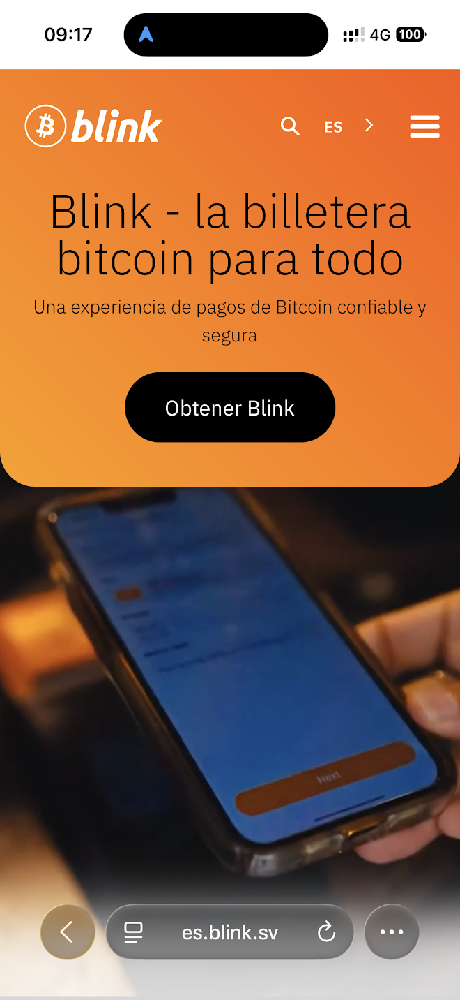
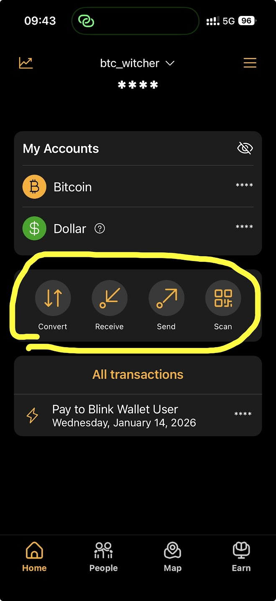

# Bitcoin en la vida diaria 💸
## Simple. Práctico. Sin humo.

<!--
Hoy no hablamos de inversión.
No prometemos dinero.
Hoy aprendemos a usar bitcoin como dinero.
Si sales usando bitcoin, ya ganaste.
-->

---

## http://blink.sv/

Blink: bitcoin beach wallet

---
## Para quién es esto 👤

🧠 para personas que piensan antes de confiar  
👀 que hacen preguntas  
⚖️ que no compran cuentos  
🚀 que quieren aprender algo útil  

<!--
Esto no es para promesas rápidas.
Es para personas prácticas.
Aquí nadie viene a convencer.
Solo mostramos cómo funciona y tú decides.
-->

---

## Objetivo de hoy 🎯

✅ wallet instalado  
✅ enviar bitcoin  
✅ recibir bitcoin  
✅ entender lightning vs onchain  
✅ saber dónde seguir  

<!--
No salimos con teoría.
Salimos con algo funcionando en tu celular.
-->

---

## Qué es el dinero 🧱

👷 trabajas  
💵 recibes dinero  
📉 con el tiempo vale menos  

Esto no es normal.

<!--
Si trabajas hoy y no gastas nada,
igual tu dinero pierde valor.
Eso es una pérdida de tu trabajo.
Bitcoin intenta resolver esto.
-->

---

## Bitcoin es dinero ⚡

🧾 guarda valor  
🌍 funciona sin fronteras  
⛔ nadie puede imprimir más  

<!--
No es una empresa.
No es un banco.
No es crypto random.
Tiene reglas fijas.
-->

---

## Lightning vs Onchain ⚖️

⚡ Lightning  
💵 como efectivo  
⚡ rápido  
💸 barato  
☕ pagos diarios  

⛓️ Onchain  
🏦 como transferencia bancaria  
🐢 más lento  
💰 más caro  
🔒 montos grandes  

<!--
No eliges uno.
Usas ambos según el caso.
Como efectivo y banco.
-->

---

## Casos reales 🧩

🛒 pagar algo  
📱 enviar dinero  
🏪 vender algo  
🏧 cambiar a pesos  
📈 invertir de forma segura  

<!--
Bitcoin no es solo para pagar.
También sirve para guardar valor en el tiempo.
Pero solo de una forma específica y simple.
-->
---
## Lo que NO hacemos 🚫

📉 trading  
🪙 criptomonedas  
🎲 apuestas  
📊 predicción de precios  

<!--
No operamos.
No recomendamos tokens.
No prometemos retornos.
No jugamos a ser expertos.
-->
---
## Fuera de nuestro horizonte ⛔

🧪 productos experimentales  
🧠 estrategias complejas  
🏦 yield, lending, derivados  
🧩 DeFi  

<!--
Todo esto existe.
Pero no es para empezar.
Primero dinero.
Primero uso.
Primero entender.
-->
---

## Wallet 📲

Instalamos ahora  
Bitcoin Beach Wallet  

🇪🇸 español  
🙂 simple  
⚡ lightning activo  

<!--
Saca tu celular.
Ve a la tienda.
Busca Bitcoin Beach Wallet.
Instálalo ahora.
No seguimos hasta que todos lo tengan.
-->

---

## Primera transacción 🔁

📤 yo envío sats  
📥 tú recibes  
🔄 tú envías a otra persona  

QR  
invoice  
contacto  

<!--
Voy a enviar sats.
Cuando recibas, levanta la mano.
Luego envías a la persona al lado.
Así se aprende.
-->

---

## Como WhatsApp 💬

📩 enviar  
📨 recibir  
⏱️ segundos  
🌍 sin banco  

<!--
Esto es lightning.
Funciona ahora.
Sin horarios.
Sin permisos.
-->

---

## Seguridad básica 🔐

🔑 12 palabras  
🧠 son la llave  
🚫 nadie las pide  
📵 no fotos  

<!--
Si alguien pide tus 12 palabras, es estafa.
Siempre.
Sin excepciones.
-->

---

## Tipos de wallets 🧰

⚡ para gastar  
🔒 para guardar  

No es lo mismo.

<!--
Este wallet es para usar.
No para guardar ahorros grandes.
Como efectivo en el bolsillo.
-->

---

## Comprar y vender 🔄

🤝 p2p  
🏧 Nequi  
🇨🇴 soluciones locales  

ColBitcoin lo explica.

<!--
Sí se puede en Colombia.
Sí funciona.
Pero hay que hacerlo bien.
ColBitcoin muestra cómo.
-->
---
## Inversión segura 📈

DCA  
Dollar Cost Average  

⏱️ compras pequeñas y regulares  
🧠 no requiere conocimiento técnico  
⚖️ reduce el riesgo  
😴 tranquilidad y buen dormir  

<!--
DCA significa comprar poco a poco, con el tiempo.
No intentas adivinar el precio.
No miras gráficos.
No tomas decisiones emocionales.
Es la forma más simple y más usada por gente seria.
-->
---
## Qué DCA NO es 🚫

❌ no es trading  
❌ no es hacerse rico rápido  
❌ no es mirar el precio cada día  

Es disciplina. Nada más.

<!--
Si buscas adrenalina, esto no es para ti.
DCA es aburrido.
Y justamente por eso funciona.
-->
---
## Comunidad 🤝

📍 Medellín  
👥 gente real  
☕ encuentros  
📚 apoyo  

<!--
Bitcoin no se aprende solo.
Se aprende con gente.
-->

---

## Próximos pasos 🚀

ColBitcoin  
Mi Primer Bitcoin  
Satoshi Team  
WhatsApp  
Telegram  

<!--
Hoy fue el primer paso.
Aquí están los siguientes.
-->

---

## Para llevar 🧠

Bitcoin es dinero
que respeta
tu trabajo y tu tiempo

<!--
No tienes que creerme.
Úsalo.
Decide tú.
-->

---

# Contacto

**Janusz Nowakowski**

https://cloudindustry.ch/bitcoin/

**Bitcoin Medellin 2026**
